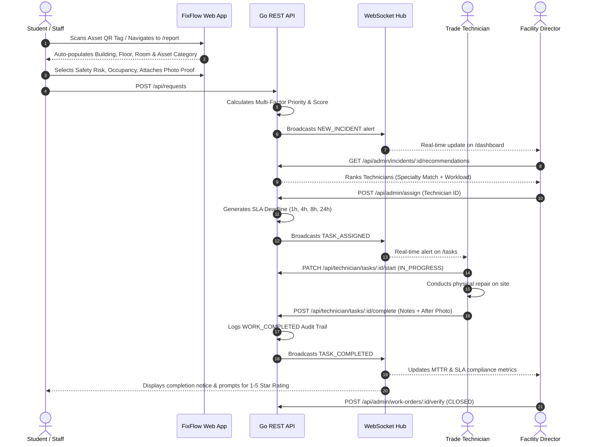

# FixFlow: Enterprise Smart Campus Maintenance & Facility Operations Platform

[](https://nextjs.org/)
[](https://react.dev/)
[](https://go.dev/)
[](https://gin-gonic.com/)
[](https://www.postgresql.org/)
[](https://www.docker.com/)
[](https://tailwindcss.com/)
[](https://www.typescriptlang.org/)
[](LICENSE)

> **FixFlow** is an enterprise-grade, real-time facility operations and asset maintenance management platform purpose-built for university faculties, higher education institutes, and corporate campuses. It unifies campus occupants, on-ground maintenance technicians, and facility administrators into a single automated, transparent, and audit-verifiable ecosystem.

---

## 🌐 Live Deployments & Links

- **Live Web Application**: [https://fixflow-campus-maintenance.vercel.app](https://fixflow-campus-maintenance.vercel.app)
- **Source Code Repository**: [https://github.com/Pamithra/fixflow-campus-maintenance](https://github.com/Pamithra/fixflow-campus-maintenance)

---

## 📌 The Campus Facility Problem

Traditional maintenance workflows in university campuses and enterprise facilities suffer from severe operational friction:

1. **Vague & Slow Reporting**: Campus occupants submit incomplete reports via phone calls or unstructured emails (*e.g., "The AC in the 2nd floor lab isn't working"*). Technicians waste hours simply locating the affected equipment or room.
2. **Subjective Manual Triage**: Facility managers manually triage complaints, leading to misprioritization, biased response times, and critical safety hazards being overlooked.
3. **Lack of Field Accountability**: Technicians receive unstructured verbal assignments with no photographic evidence, completion checklists, or verified timestamps.
4. **Zero Real-Time Visibility**: University administrators lack visibility into SLA compliance, recurring equipment failures, Mean Time to Repair (MTTR), and technician workload balance.

**FixFlow eliminates these bottlenecks through physical QR asset tagging, algorithmic SLA calculation, automated skill-based dispatching, photographic proof of work, and real-time WebSocket synchronization.**

---

## 🎯 Core Architectural Pillars & Features

```
                                  ┌────────────────────────┐
                                  │   Campus Occupants     │
                                  │   (Students / Staff)   │
                                  └───────────┬────────────┘
                                              │ Scans QR Tag
                                              ▼
                                  ┌────────────────────────┐
                                  │ Rapid Incident Portal  │
                                  │   (/report with Auto)  │
                                  └───────────┬────────────┘
                                              │ POST /api/requests
                                              ▼
┌────────────────────────────────────────────────────────────────────────────────────────┐
│                                 FixFlow Go REST API                                    │
│                                                                                        │
│   ┌────────────────────────┐    ┌────────────────────────┐    ┌────────────────────┐   │
│   │ Deterministic SLA &    │    │ Skill-Based Dispatch & │    │ 30s Background SLA │   │
│   │ Priority Engine        │    │ Recommendation Engine  │    │ Escalation Worker  │   │
│   └───────────┬────────────┘    └───────────┬────────────┘    └─────────┬──────────┘   │
└───────────────┼─────────────────────────────┼───────────────────────────┼──────────────┘
                │                             │                           │
                ▼                             ▼                           ▼
    ┌───────────────────────┐     ┌───────────────────────┐   ┌───────────────────────┐
    │ Gorilla WebSocket Hub │     │ PostgreSQL 16 DB      │   │ SMS Notification Hub  │
    │ (Real-time Broadcast) │     │ (GORM ORM + Audits)   │   │ (Twilio / Notify.lk)  │
    └───────────┬───────────┘     └───────────────────────┘   └───────────┬───────────┘
                │                                                         │
        ┌───────┴────────────────────────┐                        ┌───────┴───────────────┐
        ▼                                ▼                        ▼                       ▼
┌────────────────────────┐   ┌────────────────────────┐   ┌───────────────────────────────  ┐
│ Facility Command Center│   │ Field Technician Board │   │ Occupant & Tech Real Phone      │
│ (/dashboard)           │   │ (/tasks Mobile View)   │   │ Notifications(Assignment/Done)  │
└────────────────────────┘   └────────────────────────┘   └───────────────────────────────  ┘
```

---

### 1. 📲 Zero-Typing QR Asset Tagging & Incident Reporting (`/report`)
- Every physical campus asset (HVAC unit, smart projector, main distribution board, network switch) is indexed with a physical QR code.
- Scanning instantly opens the incident reporting portal and **auto-populates the entire campus location hierarchy**:
  - **Building / Campus Phase** (*e.g., New Building / Phase 2*)
  - **Floor Level** (*e.g., Floor 0 / Ground*)
  - **Room / Laboratory** (*e.g., ERP Laboratory*)
  - **Category** (*e.g., Air Conditioners*)
- Integrated HTML5 camera scanner with native browser `BarcodeDetector` API and fallback manual tag input.
- Occupants report an incident in under **30 seconds**.

---

### 2. 🧠 Deterministic SLA & Multi-Factor Priority Engine
FixFlow replaces subjective urgency selection with a deterministic mathematical scoring model:

$$\text{Priority Score} = W_{\text{safety}} + W_{\text{unusable}} + W_{\text{occupancy}}$$

- **Safety Hazard ($W_{\text{safety}} = 40$ pts)**: Immediate electrical, water leakage, or physical hazards immediately elevate tickets.
- **Operational / Usability Impact ($W_{\text{unusable}} = 35$ pts)**: Room or equipment completely unusable halting academic activity.
- **Occupancy Impact ($W_{\text{occupancy}} = 5 \text{ to } 25$ pts)**:
  - $> 10$ people affected: $+25$ pts
  - $2 - 10$ people affected: $+15$ pts
  - $1$ person affected: $+5$ pts
- **Direct Emergency Escalation**: Any ticket flagged with `SafetyRisk = true` or `ImmediateAttention = true` is automatically locked at a score of **95** (`CRITICAL`).

#### Strict SLA Target Matrix:
| Priority Level | Score Range | Guaranteed SLA Target | Operational Standard |
| :--- | :---: | :---: | :--- |
| **CRITICAL** | $75 - 100$ | **1 Hour** | Immediate dispatch (hazards, exam halls) |
| **HIGH** | $50 - 74$ | **4 Hours** | Same-session resolution (lab equipment, ACs) |
| **MEDIUM** | $25 - 49$ | **8 Hours** | Same-day resolution (routine lighting, furniture) |
| **LOW** | $0 - 24$ | **24 Hours** | Next-day maintenance (minor cosmetic repairs) |

- **Automated Background Worker**: A dedicated Go goroutine runs every **30 seconds**, compares active work orders against `sla_deadline`, flags breached tickets (`sla_breached = true`), and generates tamper-evident audit records.

---

### 3. 🎯 Smart Skill-Based Dispatch & Recommendation Engine
When an incident is reported, FixFlow calculates a **Technician Recommendation Score** for every active technician:
- **Availability Bonus (+50 pts)**: Granted to technicians with $0$ active jobs.
- **Workload Penalty**: Deducts $15$ points per active task currently assigned to the technician.
- **Trade Specialty Match (+50 pts)**:
  - **HVAC & Cooling Systems** $\leftrightarrow$ General / HVAC Technicians
  - **Electrical & Power Distribution** $\leftrightarrow$ Electrical Technicians
  - **Plumbing & Sanitary** $\leftrightarrow$ Plumbing Technicians
  - **Audio-Visual & Networking** $\leftrightarrow$ IT / AV Technicians
- Allows instant one-click dispatch from the Admin Command Center with automatic SLA deadline creation.

---

### 4. 🛠️ Mobile-First Field Technician Portal (`/tasks`)
- Optimized for field staff using mobile devices and tablets on the campus ground.
- Real-time task board with status progression:
  $$\text{ASSIGNED} \xrightarrow{\text{Start Task}} \text{IN\_PROGRESS} \xrightarrow{\text{Complete Task}} \text{COMPLETED}$$
- **Photo Proof**: Technicians can upload a verified "After-Repair" photograph before a work order can be completed.
- **Diagnostic Notes**: Captures detailed technician resolution notes, parts replaced, and time taken.
- Client-side image compression (`compressImageToDataUrl`) for fast mobile uploads over cellular networks.

---

### 5. 📊 Facility Operations Command Center (`/dashboard`)
- Real-time executive dashboard for campus facility directors and supervisors:
  - **Real-Time KPI Cards**: Total Tickets, Active Work Orders, Overdue SLA Breaches, Average MTTR (Mean Time to Repair in hours), and SLA Compliance Rate (%).
  - **Trade Workload Analytics**: Interactive bar chart comparing incident volume across **HVAC**, **Electrical**, **Plumbing**, and **IT**.
  - **Interactive Ticket Ledger**: Dynamic filtering by Status (`OVERDUE`, `PENDING`, `ONGOING`, `COMPLETED`, `CLOSED`) and Priority (`CRITICAL`, `HIGH`, `MEDIUM`, `LOW`).
  - **Inspection Drawer**: Full-screen modal to review Before vs. After repair photos, reporter feedback star ratings, and the immutable audit trail.
  - **Administrative Actions**: One-click to **"Verify & Close"** or **"Reopen Work Order"** if maintenance quality is unsatisfactory.

---

### 6. 🔐 Enterprise Role-Based Access Control (RBAC) & Security
- Four distinct domain roles:
  1. `STUDENT`: Can report incidents, track personal ticket history, and submit star ratings upon completion.
  2. `STAFF`: Faculty and department staff with incident submission and departmental tracking privileges.
  3. `TECHNICIAN`: Can report incidents, access to assigned trade tasks, repair execution, photo uploads, and resolution notes.
  4. `ADMIN`: Full facility oversight, manual/automated dispatch, analytics, and work order verification.
- **Boundary Guards**: Administrators attempting to access the issue reporting portal receive a clear access restriction notification redirecting them to the Command Dashboard.
- **Stateless Authentication**: Signed **JWT (JSON Web Tokens)** with 24-hour expiration and password hashing using **Bcrypt**.

---

### 7. ⚡ Real-Time WebSockets & Notifications
- **Gorilla WebSocket Hub**: Broadcasts events (`NEW_INCIDENT`, `TASK_ASSIGNED`, `TASK_STARTED`, `TASK_COMPLETED`, `SLA_BREACH`) to all active browser sessions without polling or UI reloads.
- **Multi-Provider SMS Gateway**:
  - Simulated in-app notification center for local development.
  - Integration with **Twilio** (Global SMS)  for deliver notifications.

---

## 🏛️ Campus Digital Twin Infrastructure

FixFlow is pre-seeded with a comprehensive digital twin of the **Faculty of Information Technology**:

```
IT Faculty Campus
│
├── 🏢 Phase 1: Old Building (Code: IT-OLD)
│   ├── Floor 0 (Ground): Workshop, Staff Room (Ground Floor)
│   ├── Floor 1: Laboratory-01, 1LH01A, 1LH02A, Staff Room (1st Floor)
│   ├── Floor 2: Laboratory-02, Multimedia Research Lab, 2LH01A, Audio Visual Unit, Staff Room (2nd Floor)
│   ├── Floor 3: Laboratory-03, Laboratory-04, Multimedia Development Lab, 3LH01A, 3LH02A, Staff Room (3rd Floor)
│   └── Floor 4: Network Laboratory, Hardware Lab, Embedded Systems Lab, 4LH01A (Auditorium), Staff Room (4th Floor)
│
└── 🏢 Phase 2: New Building (Code: IT-NEW)
    ├── Floor 0 (Ground): ERP Laboratory, Data Sciences Laboratory, 0LH01A, 0LH02A, Staff Room (Phase 2 Ground)
    ├── Floor 1: Laboratory-07, 1LH03A, Staff Room (Phase 2 1st Floor)
    ├── Floor 2: Laboratory-05, HPC Laboratory, 2LH02A, 2LH03A, Staff Room (Phase 2 2nd Floor)
    ├── Floor 3: Laboratory-08, Staff Room (Phase 2 3rd Floor)
    └── Floor 4: Electronic & Embedded Systems Lab, 4LH02A (Auditorium), Staff Room (Phase 2 4th Floor)
```

---

## 🛠️ Complete Technology Stack

| Domain | Technology | Version | Purpose |
| :--- | :--- | :--- | :--- |
| **Frontend Framework** | [Next.js](https://nextjs.org/) (App Router) | `16.3.5` | React server and client components, server rendering, routing |
| **UI Library** | [React](https://react.dev/) | `19.2.8` | Declarative UI component tree |
| **Styling** | [Tailwind CSS](https://tailwindcss.com/) | `4.x` | Modern utility-first styling with dark/light themes |
| **Component Primitives**| [Radix / Base UI](https://base-ui.com/) | `1.8.0` | Accessible dialogs, dropdowns, and modals |
| **Iconography** | [Lucide React](https://lucide.dev/) | `1.46.0` | Clean, modern iconography |
| **Data Visualization** | [Recharts](https://recharts.org/) | `3.10.1` | Real-time SVG bar charts and KPI metrics |
| **Backend Language** | [Golang](https://go.dev/) | `1.27` | High-concurrency, memory-efficient compiled backend |
| **Web Framework** | [Gin Web Framework](https://gin-gonic.com/) | `v1.12.0` | High-throughput HTTP routing, CORS, and JSON binding |
| **Database & ORM** | [PostgreSQL](https://www.postgresql.org/) + [GORM](https://gorm.io/) | `PG 16 / GORM v1.31` | Relational storage, auto-migrations, indexing, and foreign keys |
| **Real-Time Engine** | [Gorilla WebSocket](https://github.com/gorilla/websocket) | `v1.5.3` | Bi-directional real-time event distribution |
| **Authentication** | [golang-jwt/jwt](https://github.com/golang-jwt/jwt) | `v5.3.1` | Cryptographic JWT claims and signature validation |
| **Password Security** | [golang.org/x/crypto/bcrypt](https://pkg.go.dev/golang.org/x/crypto/bcrypt) | `v0.57.0` | Salted SHA hashing for user passwords |
| **Containerization** | [Docker](https://www.docker.com/) & Docker Compose | `v2` | Zero-dependency local PostgreSQL 16 orchestration |
| **Production Hosting** | [Vercel](https://vercel.com/) | Cloud | Global CDN frontend deployment |

---

## 📁 Repository Directory Structure

```
fixflow/
├── docker-compose.yml             # PostgreSQL 16 container definition
├── .env.example                   # Root environment configuration template
├── README.md                      # Comprehensive project documentation
│
├── backend/                       # Golang RESTful API Backend Service
│   ├── cmd/
│   │   └── server/
│   │       └── main.go            # Server entry point, middleware, routes, and workers
│   ├── internal/
│   │   ├── auth/
│   │   │   └── jwt.go             # JWT signing, validation, and claim parsing
│   │   ├── config/
│   │   │   └── config.go          # Environment configuration loader
│   │   ├── database/
│   │   │   ├── db.go              # PostgreSQL connection & GORM schema auto-migration
│   │   │   └── seed.go            # Campus digital twin, test accounts & asset seeds
│   │   ├── handlers/              # Gin HTTP Controllers
│   │   │   ├── admin_handler.go      # Dispatch, recommendations, verify & reopen
│   │   │   ├── analytics_handler.go  # KPI calculations, MTTR & category metrics
│   │   │   ├── auth_handler.go       # Registration, login & password reset
│   │   │   ├── facilities_handler.go # Buildings, floors, rooms & asset lookup
│   │   │   ├── technician_handler.go # Technician task progression & completion
│   │   │   ├── ticket_handler.go     # Incident creation & priority calculation
│   │   │   └── upload_handler.go     # Multipart photo uploads & serving
│   │   ├── middleware/
│   │   │   └── auth.go            # JWT bearer token verification & role checks
│   │   ├── models/
│   │   │   ├── enums.go           # UserRole, PriorityLevel, RequestStatus, WorkOrderStatus
│   │   │   └── models.go          # GORM structs: User, Building, Room, Asset, Ticket, AuditLog
│   │   ├── services/
│   │   │   ├── sla_worker.go      # 30-second background goroutine for SLA monitoring
│   │   │   └── sms_service.go     # Multi-gateway SMS dispatcher (Twilio / Notify.lk)
│   │   └── websocket/
│   │       └── hub.go             # Thread-safe WebSocket hub & event broadcaster
│   ├── uploads/                   # Storage directory for before/after proof photos
│   ├── go.mod                     # Go dependencies
│   └── go.sum                     # Go checksums
│
└── frontend/                      # Next.js 16 Responsive Web Application
    ├── src/
    │   ├── app/
    │   │   ├── layout.tsx         # Root layout with AuthProvider & notification toast
    │   │   ├── page.tsx           # Campus landing page with live statistics & QR scanner
    │   │   ├── globals.css        # Tailwind CSS styling and theme configuration
    │   │   ├── login/
    │   │   │   └── page.tsx       # Authentication portal with admin role guards
    │   │   ├── signup/
    │   │   │   └── page.tsx       # Registration portal with trade specialty selector
    │   │   ├── report/
    │   │   │   └── page.tsx       # QR incident reporting, photo upload & history tab
    │   │   ├── tasks/
    │   │   │   └── page.tsx       # Mobile technician execution board with photo proof
    │   │   └── dashboard/
    │   │       └── page.tsx       # Facility director command center & analytics
    │   ├── components/
    │   │   ├── Navbar.tsx         # Header navigation with active user role badge
    │   │   ├── PhotoPreviewModal.tsx # Fullscreen modal for photo inspection
    │   │   └── ui/                # Base UI components (Buttons, Cards, Dialogs, Badges)
    │   ├── context/
    │   │   └── AuthContext.tsx    # Global authentication session & permission state
    │   ├── hooks/
    │   │   └── useWebSocket.ts    # React hook for real-time WebSocket connection
    │   └── lib/
    │       ├── api.ts             # Axios client with JWT interceptor & 401 handler
    │       └── utils.ts           # Class merger & image compression utilities
    ├── package.json               # Node.js dependencies
    ├── tsconfig.json              # TypeScript compilation settings
    └── next.config.ts             # Next.js configuration
```

---

## 📡 RESTful API Reference

### Public Endpoints
| Method | Endpoint | Description |
| :--- | :--- | :--- |
| `GET` | `/api/health` | System health check and database connectivity status |
| `GET` | `/api/ws` | Gorilla WebSocket bi-directional connection endpoint |
| `POST`| `/api/auth/login` | Authenticates user credentials and issues JWT token |
| `POST`| `/api/auth/register` | Registers a new Student, Staff, or Technician account |
| `POST`| `/api/auth/reset-password` | Simulates password recovery flow |
| `GET` | `/api/facilities` | Returns full campus hierarchy (Buildings, Floors, Rooms) |
| `GET` | `/api/assets/:tag` | Resolves asset specifications from physical QR tag |

### Authenticated Endpoints (Bearer Token Required)
| Method | Endpoint | Allowed Roles | Description |
| :--- | :--- | :--- | :--- |
| `GET` | `/api/auth/me` | All | Retrieves profile of currently authenticated user |
| `GET` | `/api/notifications/my` | All | Retrieves personal notifications / SMS history |
| `PATCH`| `/api/notifications/read` | All | Marks notification records as read |
| `POST`| `/api/upload` | All | Uploads JPEG/PNG image proof to `/uploads` |
| `POST`| `/api/requests` | Student, Staff | Submits an incident report; triggers priority calculation |
| `GET` | `/api/requests/my` | Student, Staff | Retrieves personal submitted incidents and statuses |
| `POST`| `/api/requests/:id/feedback` | Student, Staff | Submits 1-5 star rating and feedback comments |
| `GET` | `/api/technician/tasks` | Technician, Admin | Fetches active assigned work orders |
| `PATCH`| `/api/technician/tasks/:id/start` | Technician | Advances work order to `IN_PROGRESS` |
| `POST`| `/api/technician/tasks/:id/complete` | Technician | Attaches after-photo, logs notes, and marks `COMPLETED` |
| `GET` | `/api/admin/incidents` | Admin | Fetches all campus incidents with nested work orders |
| `GET` | `/api/admin/incidents/:id/recommendations` | Admin | Calculates matching scores for active technicians |
| `POST`| `/api/admin/assign` | Admin | Dispatches or reassigns technician; generates SLA timer |
| `POST`| `/api/admin/work-orders/:id/verify` | Admin | Verifies technician proof and transitions state to `CLOSED` |
| `POST`| `/api/admin/work-orders/:id/reopen` | Admin | Reopens an unsatisfied work order with feedback notes |
| `GET` | `/api/admin/analytics` | Admin | Computes KPIs, average MTTR, and specialty distribution |

---

## 🔑 Pre-Seeded Demonstration Accounts

When the backend starts up for the first time, it automatically initializes the following test accounts:

| Role | Full Name | Email Address | Password | Trade Specialty |
| :--- | :--- | :--- | :--- | :--- |
| **Admin** | Campus Maintenance Admin | `admin@fixflow.edu` | `Admin@123` | Full Facility Governance |
| **Faculty Staff** | Dr. Anura Bandara | `staff@fixflow.edu` | `Staff@123` | Academic Incident Reporting |
| **Student** | Praveen Jayasinghe | `student@fixflow.edu` | `Student@123` | Student Incident Reporting |
| **Technician (Electrical)** | Nimal Silva | `nimal.elec@fixflow.edu` | `Tech@123` | Electrical & Lighting |
| **Technician (Plumbing)** | Amal Fernando | `amal.plumb@fixflow.edu` | `Tech@123` | Plumbing & Sanitary |
| **Technician (IT / AV)** | Saman Kumara | `saman.it@fixflow.edu` | `Tech@123` | Computers, Projectors & IT |
| **Technician (HVAC / Gen)** | Kasun Perera | `kasun.general@fixflow.edu` | `Tech@123` | Air Conditioners & General |

---

## ⚡ Quick Start & Local Setup Guide

### System Prerequisites
Ensure the following tools are installed on your machine:
- **Go**: Version `1.22+` ([Download Go](https://go.dev/dl/))
- **Node.js**: Version `20+` ([Download Node.js](https://nodejs.org/))
- **Docker & Docker Desktop**: ([Download Docker](https://www.docker.com/products/docker-desktop/))
- **Git**: ([Download Git](https://git-scm.com/))

---

### Step 1: Clone the Repository
```bash
git clone https://github.com/Pamithra/fixflow-campus-maintenance.git
cd fixflow-campus-maintenance
```

---

### Step 2: Spin Up the PostgreSQL Database via Docker
```bash
docker compose up -d
```
*This launches a PostgreSQL 16 container on port `5433` (mapped from 5432 to avoid local Postgres port conflicts) with the database `fixflow_db`.*

---

### Step 3: Run the Go Backend API Server
1. Navigate to the `backend` folder:
   ```bash
   cd backend
   ```
2. Create your `.env` file from the example:
   ```bash
   cp .env.example .env
   ```
3. Run the Go server:
   ```bash
   go run cmd/server/main.go
   ```
*The server will start at `http://localhost:8080`. On its initial run, GORM automatically runs auto-migrations for all relational tables and seeds the IT Faculty campus infrastructure, test accounts, and asset tags.*

---

### Step 4: Run the Next.js Frontend
1. Open a new terminal window and navigate to `frontend`:
   ```bash
   cd frontend
   ```
2. Install dependencies:
   ```bash
   npm install
   ```
3. Create a `.env.local` file:
   ```env
   NEXT_PUBLIC_API_URL=http://localhost:8080/api
   NEXT_PUBLIC_WS_URL=ws://localhost:8080/api/ws
   ```
4. Start the Next.js development server:
   ```bash
   npm run dev
   ```
5. Open your browser and navigate to **[http://localhost:3000](http://localhost:3000)**.

---

## 🔄 End-to-End Operational Lifecycle



---

## 🛡️ Security & Quality Standards

- **Tamper-Evident Audit Trails**: Every state transition (Reported ➔ Assigned ➔ Started ➔ Completed ➔ Verified / Reopened) writes an immutable record to the `AuditLog` table containing actor ID, previous state, new state, and exact timestamp.
- **Input Sanitization & Form Validation**: Strong server-side validation using Gin's `binding:"required"` tags and client-side validation prevent malformed requests.
- **Photo Proof Integrity**: Technicians cannot close a work order without diagnostic notes and an uploaded completion photo proof.
- **Strict Role Boundaries**: Administrative credentials cannot be entered into incident reporting workflows, preventing bogus incident submissions.

---

## 🤝 Contributing

Contributions to FixFlow are welcome! To contribute:
1. Fork the project repository.
2. Create a dedicated feature branch:
   ```bash
   git checkout -b feature/AmazingFeature
   ```
3. Commit your changes:
   ```bash
   git commit -m "feat: add AmazingFeature"
   ```
4. Push to the branch:
   ```bash
   git push origin feature/AmazingFeature
   ```
5. Open a Pull Request.

---

## 👨‍💻 Author & Maintainer

**Pamithra**  
- **GitHub**: [@Pamithra](https://github.com/Pamithra)  
- **Project Repository**: [fixflow-campus-maintenance](https://github.com/Pamithra/fixflow-campus-maintenance)  
- **Live Deployment**: [fixflow-campus-maintenance.vercel.app](https://fixflow-campus-maintenance.vercel.app)
